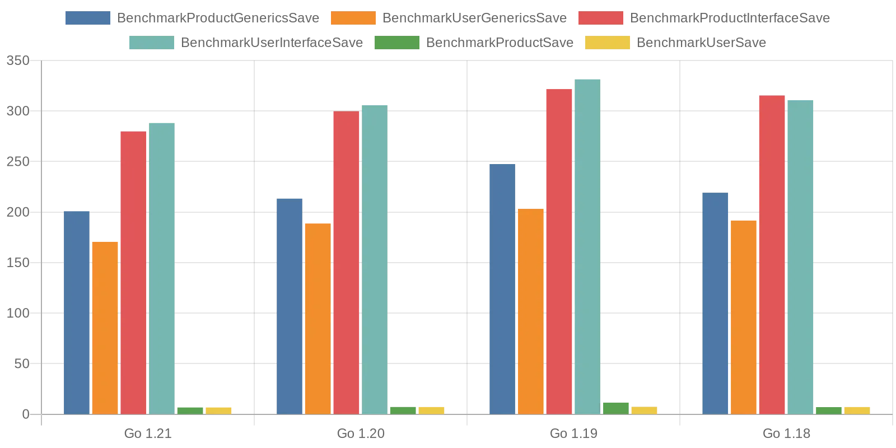

# go-generics <span style=" color: #555;"> "Benchmark Results" </span>

### Go 1.21 <span style="font-size: smaller; color: #999;">(Last version 1.21.0)</span>
```azure
cpu: Intel(R) Core(TM) i5-1038NG7 CPU @ 2.00GHz
---------------- Arrange: ----------------
BenchmarkProductGenericsSave-8           5074741               200.8 ns/op
BenchmarkUserGenericsSave-8              6153792               170.5 ns/op
BenchmarkProductInterfaceSave-8          4823200               279.8 ns/op
BenchmarkUserInterfaceSave-8             4463250               288.1 ns/op
BenchmarkProductSave-8                  178098417                6.669 ns/op
BenchmarkUserSave-8                     178863804                6.658 ns/op
```
### Go 1.20 <span style="font-size: smaller; color: #999;">(Last version 1.20.7)</span>

```azure
cpu: Intel(R) Core(TM) i5-1038NG7 CPU @ 2.00GHz
---------------- Arrange: ----------------
BenchmarkProductGenericsSave-8           4926741               213.3 ns/op
BenchmarkUserGenericsSave-8              6282783               188.7 ns/op
BenchmarkProductInterfaceSave-8          4382232               299.8 ns/op
BenchmarkUserInterfaceSave-8             4309461               305.7 ns/op
BenchmarkProductSave-8                  164147166                7.148 ns/op
BenchmarkUserSave-8                     168227570                7.100 ns/op
```
### Go 1.19 <span style="font-size: smaller; color: #999;">(Last version 1.19.12)</span>
```azure
cpu: Intel(R) Core(TM) i5-1038NG7 CPU @ 2.00GHz
---------------- Arrange: ----------------    
BenchmarkProductGenericsSave-8           4506608               247.5 ns/op
BenchmarkUserGenericsSave-8              5853972               203.2 ns/op
BenchmarkProductInterfaceSave-8          4100167               321.7 ns/op
BenchmarkUserInterfaceSave-8             3975982               331.3 ns/op
BenchmarkProductSave-8                  100000000               11.45 ns/op
BenchmarkUserSave-8                     162931731                7.362 ns/op
```

### Go 1.18 <span style="font-size: smaller; color: #999;">(Last version 1.18.10)</span>

```azure
cpu: Intel(R) Core(TM) i5-1038NG7 CPU @ 2.00GHz
---------------- Arrange: ----------------
BenchmarkProductGenericsSave-8           5142501               219.2 ns/op
BenchmarkUserGenericsSave-8              5845041               191.6 ns/op
BenchmarkProductInterfaceSave-8          4193512               315.4 ns/op
BenchmarkUserInterfaceSave-8             4225286               310.7 ns/op
BenchmarkProductSave-8                  169844490                7.028 ns/op
BenchmarkUserSave-8                     171541149                7.092 ns/op
```

### Performance Comparison Chart for Go Versions



## Summary 

* Go version 1.21 demonstrates consistent performance results, reaffirming the potential benefits of using generics for code optimization.

* Compared to previous versions (Go 1.20, Go 1.19, and Go 1.18), Go version 1.21 shows minor performance fluctuations while maintaining good execution speed for both operations using generics and operations through interfaces.

* The performance of operations using generics remains on par with competitive methods such as operations through interfaces.

* The introduction of generics in Go has the potential to significantly simplify code and enhance readability while preserving high performance.

Overall, Go version 1.21 with generics presents a promising approach for developing more optimized and maintainable code, while delivering strong execution speed.